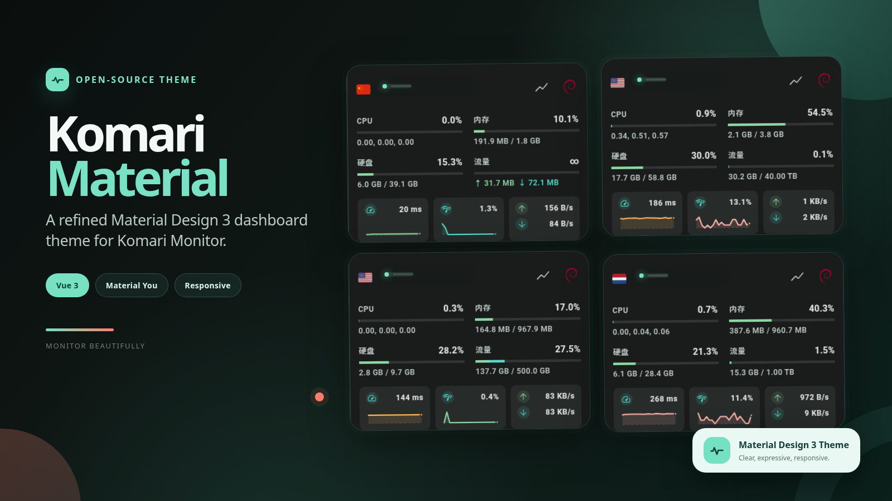

# Komari Material



<p align="center">
  <strong>为 Komari Monitor 打造的 Material Design 3 主题</strong><br>
  高信息密度、动态配色、响应式布局与可管理配置
</p>

<p align="center">
  <a href="https://github.com/Liebesfreud/Komari-Material/releases/latest"></a>
  <a href="LICENSE"></a>
  <a href="https://vuejs.org/"></a>
  <a href="https://m3.material.io/"></a>
</p>

> [!IMPORTANT]
> **Komari Material 是基于 [Komari Naive](https://github.com/lyimoexiao/komari-theme-naive/tree/master) 的二次开发项目，并非从零开始，也不是 Komari Monitor 官方主题。**<br>
> 感谢上游维护者 [lyimoexiao](https://github.com/lyimoexiao) 开源 Komari Naive。本项目保留上游的 MIT License 与原始版权声明，并在其代码基础上重新设计为 Material Design 3 风格。

## 项目关系

| 项目                                                                         | 与本项目的关系                                                    |
| ---------------------------------------------------------------------------- | ----------------------------------------------------------------- |
| [Komari Monitor](https://github.com/komari-monitor/komari)                   | 本主题所服务的服务器监控平台，提供后台、API 与主题运行环境        |
| [Komari Naive](https://github.com/lyimoexiao/komari-theme-naive/tree/master) | 本项目直接进行二次开发的原主题与代码基础                          |
| **Komari Material**                                                          | 在 Komari Naive 基础上进行的 Material Design 3 重构与持续维护版本 |

如果你喜欢本项目，也请为 **Komari Monitor** 和 **Komari Naive** 点一个 Star。没有原项目及其维护者的工作，就不会有这个主题。

## 主题简介

Komari Material 将服务器监控面板所需的信息密度与 Material You 的视觉体系结合起来。它保留 Komari 节点监控的核心能力，同时重新设计了配色、卡片、排版、状态反馈、响应式布局与后台配置体验。

主题适用于桌面端、平板和移动端。Release 中提供的构建包可以直接导入 Komari，无需手动部署前端文件。

## 主要特性

- **Material Design 3**：统一使用 MD3 色彩、排版、形状、状态层和交互动效。
- **Material You 动态配色**：支持手动种子色、内置调色盘及壁纸取色。
- **亮色与暗色模式**：可手动切换、跟随系统，并分别生成完整主题色阶。
- **多种节点布局**：提供卡片、列表和双栏紧凑列表三种展示模式。
- **完整节点信息**：展示系统信息、负载、CPU、内存、硬盘、流量、速率、延迟和丢包摘要。
- **卡片材质控制**：支持 MD3 实色表面与半透明材质，可调整不透明度和亮色对比度。
- **响应式设计**：针对桌面、平板和移动端调整信息密度与交互布局。
- **可管理主题配置**：通过 `komari-theme.json` 在 Komari 后台集中管理主题选项。
- **内容扩展**：支持公告、节点分组、搜索、备案信息和自定义图片或视频背景。
- **连接方式可选**：支持 WebSocket 与 HTTP RPC，可根据部署环境切换。

## 安装

### 使用 Release 构建包

1. 前往 [Releases](https://github.com/Liebesfreud/Komari-Material/releases/latest)。
2. 下载最新的 `komari-theme-material-build-*.zip`。
3. 登录 Komari 管理后台，进入 **设置 → 主题管理**。
4. 上传下载的 zip 文件并切换到 **Komari Material**。
5. 刷新监控页面。

> [!WARNING]
> 请直接上传 Release 中的主题 zip，不要解压，也不要使用 GitHub 自动生成的 Source code 压缩包。

## 主题配置

主题配置由 [`komari-theme.json`](komari-theme.json) 定义。安装后可在 Komari 后台管理以下内容：

| 分类       | 可配置内容                                           |
| ---------- | ---------------------------------------------------- |
| 基础设置   | 数据刷新间隔、RPC 模式、默认视图、登录入口、延迟图表 |
| 节点展示   | 延迟与丢包摘要、分组过滤、状态样式、进度条布局       |
| 卡片视图   | 实色或半透明材质、不透明度、亮色对比度、流量样式     |
| 页面布局   | 最大宽度、全宽模式、界面密度、字体与数字字体         |
| 动态配色   | 种子色、预设调色盘、壁纸取色、亮暗色模式             |
| 自定义内容 | 公告、ICP备案、公安备案                              |
| 页面背景   | 图片或视频背景、亮暗色资源、模糊与遮罩强度           |

访客还可以通过页面右上角的外观面板在本地切换主题、配色、密度、卡片材质和壁纸效果。恢复后台外观后，将重新使用管理员配置。

## 从源码构建

### 环境要求

- Node.js `^20.19.0 || >=22.12.0`
- pnpm `10.x`

### 构建主题包

```bash
pnpm install
pnpm build
```

构建过程会执行 TypeScript 类型检查和 Vite 生产构建，并在仓库根目录生成：

```text
komari-theme-material-build-<commit>.zip
```

主题包包含：

```text
dist/               生产构建文件
komari-theme.json   Komari 主题清单与配置
preview.png         主题管理页面使用的预览封面
```

## 本地开发

```bash
pnpm install
cp .env.example .env.local
pnpm dev
```

如需把本地请求代理到已有的 Komari 实例，可编辑 `.env.local`：

```env
KOMARI_PROXY_TARGET=https://your-komari.example.com
VITE_API_BASE=/api
```

常用命令：

```bash
pnpm dev       # 启动 Vite 开发服务器
pnpm lint      # 使用 oxlint 和 eslint 检查并修复代码风格
pnpm build     # 类型检查、生产构建并生成 Komari 主题包
pnpm preview   # 预览生产构建结果
```

仓库目前没有独立测试套件，提交前请至少运行 `pnpm lint` 和 `pnpm build`。

## 项目结构

```text
src/                  Vue 应用源码
src/components/       节点卡片、列表、图表与外观面板
src/stores/           Pinia 状态管理
src/utils/            API、RPC、格式化与 Material 主题工具
public/images/        运行时旗帜和系统 Logo
docs/preview.png      README 封面与主题包预览图
komari-theme.json     主题清单与后台配置定义
vite.config.ts        构建、代码分包与主题 zip 打包
```

## 二次开发说明

本仓库是在 **[Komari Naive](https://github.com/lyimoexiao/komari-theme-naive/tree/master)** 的开源代码基础上进行的二次开发，主要工作包括但不限于：

- 将整体视觉体系重构为 Material Design 3 / Material You。
- 重构节点卡片、长列表和双栏紧凑列表。
- 增加动态配色、壁纸取色和卡片材质配置。
- 完善桌面端与移动端响应式布局。
- 扩展主题后台配置、公告、备案与自定义背景能力。
- 调整构建流程，生成可直接导入 Komari 的主题包。

这些改动不改变项目来源。本项目会持续保留上游作者的版权信息，并遵循 MIT License 的署名与许可要求。

## 致谢

特别感谢：

- **[lyimoexiao](https://github.com/lyimoexiao)** — 维护并开源了本项目的直接上游 [Komari Naive](https://github.com/lyimoexiao/komari-theme-naive/tree/master)，为本项目提供了原始主题与代码基础。
- **[Komari Monitor](https://github.com/komari-monitor/komari)** — 提供优秀、轻量的服务器监控平台和主题生态。

同时感谢以下开源项目：

- [Vue](https://vuejs.org/)
- [Vite](https://vite.dev/)
- [Material Web](https://material-web.dev/)
- [Material Color Utilities](https://github.com/material-foundation/material-color-utilities)
- [UnoCSS](https://unocss.dev/)
- [Apache ECharts](https://echarts.apache.org/)

## 许可证

本项目基于 [MIT License](LICENSE) 开源。

直接上游 Komari Naive 使用 MIT License，其许可证文件保留了 `Copyright (c) 2025 Tony Liu`。本仓库继续保留该原始版权声明，并增加 `Copyright (c) 2026 Liebesfreud` 作为二次开发部分的署名。

使用、修改或分发本项目时，请同时保留原始版权声明、二次开发署名与许可证文本。
